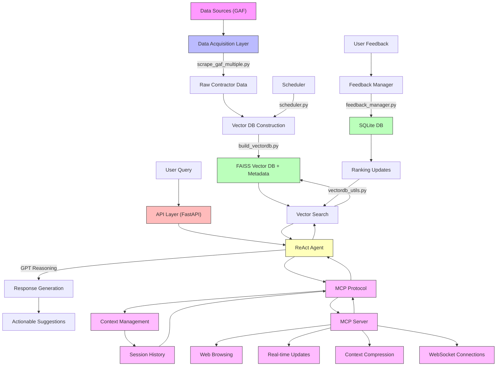

# GFA AI Sales Intelligence Platform

An AI-powered B2B sales intelligence platform for roofing distributors, leveraging GAF contractor data to generate actionable sales insights and recommendations.

## Overview

This platform helps sales teams identify, understand, and effectively engage with decision-makers by:

- Scraping and processing contractor data from GAF
- Providing semantic search capabilities
- Generating actionable sales recommendations
- Learning from user feedback to improve results
- Automating data updates and maintenance
- Implementing Model Context Protocol (MCP) for enhanced context management
- Real-time updates and web browsing capabilities through MCP Server

## System Architecture



## Key Components

### 1. Data Acquisition & Preprocessing
- **Script:** `scrape_gaf_multiple.py`
- Extracts structured contractor information from GAF web pages
- Captures name, about, ratings, address, phone, certifications, etc.

### 2. Vector Database Construction
- **Script:** `build_vectordb.py`
- Uses FAISS and sentence-transformers
- Converts contractor profiles into vector embeddings
- Enables efficient semantic search

### 3. Automated Updates
- **Script:** `scheduler.py`
- Runs weekly updates (every Monday at 2:00 AM)
- Ensures data freshness

### 4. Semantic Search & ReAct Agent
- **Core Files:** `vectordb_utils.py`, `react_agent.py`
- Implements dynamic business metrics simulation
- Generates future-oriented recommendations
- Uses GPT for reasoning and response generation

### 5. Feedback System
- **Core File:** `feedback_manager.py`
- Collects and processes user feedback
- Implements Wilson score interval for robust ranking
- Continuously improves search results

### 6. API Layer
- **Core File:** `app.py`
- Built with FastAPI
- Handles queries and feedback submission
- Manages CORS and error handling

### 7. Model Context Protocol (MCP)
- **Core Files:** `mcp_protocol.py`, `mcp_server.py`
- Implements context management for AI interactions
- Features:
  - Session-based context tracking
  - Query history management
  - Context persistence and retrieval
  - Message history tracking
  - Metadata management
  - Web browsing capabilities
  - Real-time updates via WebSocket
  - Context compression and optimization
- Benefits:
  - Enhanced conversation continuity
  - Improved context awareness
  - Better response quality
  - Session state management
  - Debugging and monitoring capabilities
  - Real-time data updates
  - Web search integration
  - Optimized context handling

### 8. MCP Server
- **Core File:** `mcp_server.py`
- Provides enhanced capabilities for the MCP system
- Features:
  - WebSocket-based real-time updates
  - Web browsing and search integration
  - Context compression and optimization
  - Session management
  - Real-time data enrichment
- Endpoints:
  - WebSocket: `/ws/{session_id}`
  - Context Enrichment: `/enrich/{session_id}`
  - Context Retrieval: `/context/{session_id}`
  - Context Compression: `/compress/{session_id}`

## Installation

1. Clone the repository:
```bash
git clone [repository-url]
cd GFA_AI
```

2. Create and activate a virtual environment:
```bash
python -m venv venv
source venv/bin/activate  # On Windows: venv\Scripts\activate
```

3. Install dependencies:
```bash
pip install -r requirements.txt
```

4. Set up environment variables:
```bash
cp .env.example .env
# Edit .env with your OpenAI API key and other settings
```

## Usage

1. Start the main API server:
```bash
uvicorn app:app --reload
```

2. Start the MCP Server:
```bash
uvicorn mcp_server:mcp_app --reload --port 8001
```

3. Access the APIs:
- Main API: `http://localhost:8000`
- MCP Server: `http://localhost:8001`

### API Endpoints

- `POST /chat`: Submit queries and get recommendations
- `POST /feedback`: Submit feedback on results
- `GET /feedback/stats`: View feedback statistics

### MCP Server Endpoints

1. WebSocket Connection:
```javascript
const ws = new WebSocket('ws://localhost:8001/ws/{session_id}');
ws.onmessage = (event) => {
    const data = JSON.parse(event.data);
    console.log('Received:', data);
};
```

2. Context Enrichment:
```bash
curl -X POST http://localhost:8001/enrich/{session_id} \
     -H "Content-Type: application/json" \
     -d '{"additional_data": "value"}'
```

3. Context Retrieval:
```bash
curl http://localhost:8001/context/{session_id}
```

4. Context Compression:
```bash
curl -X POST http://localhost:8001/compress/{session_id}
```

### Example Queries with MCP Server

1. Web Search Integration:
```json
{
    "query": "Find roofing contractors in New York",
    "web_search": true
}
```

2. Real-time Updates:
```javascript
// Connect to WebSocket
const ws = new WebSocket('ws://localhost:8001/ws/{session_id}');

// Send web search request
ws.send(JSON.stringify({
    "type": "web_search",
    "query": "roofing contractors new york"
}));

// Receive real-time updates
ws.onmessage = (event) => {
    const data = JSON.parse(event.data);
    if (data.type === "update") {
        console.log("Real-time update:", data.data);
    }
};
```

## Test Cases

1. General Contractor Search
2. Specific Business Need
3. Years-Based Query
4. Activity-Based Prioritization
5. Regular Follow-Up
6. Feedback Submission
7. Feedback Statistics
8. MCP Context Management
9. Session Continuity
10. Context Persistence
11. Web Browsing Integration
12. Real-time Updates
13. Context Compression
14. WebSocket Communication

## Future Improvements

1. **Agentic RAG Implementation**
   - Iterative query processing
   - Multi-hop reasoning
   - Dynamic context adaptation

2. **Model Fine-Tuning**
   - Domain-specific training
   - Business terminology optimization
   - Workflow alignment

3. **Business Metric Integration**
   - Apache Hive integration
   - Real-time business insights
   - Advanced analytics support

4. **MCP Enhancements**
   - Persistent storage for contexts
   - Advanced context compression
   - Context-aware routing
   - Multi-session management

5. **MCP Server Enhancements**
   - Advanced web search capabilities
   - Multi-source data integration
   - Enhanced real-time analytics
   - Advanced context compression algorithms
   - WebSocket clustering for scalability

## MCP Server Implementation

### Core Components

#### MCPServer Class
- Manages WebSocket connections
- Handles context management
- Implements web search functionality
- Provides real-time updates

#### Web Search Implementation
- Uses Google Custom Search API
- Supports real-time result updates
- Integrates search results into context
- Provides error handling and notifications

#### Context Management
- Session-based context storage
- Context compression for optimization
- Real-time context updates
- Context enrichment capabilities

### WebSocket Features
- Real-time bidirectional communication
- Automatic context synchronization
- Error handling and reconnection support
- Session management

### Security Features
- Environment variable based configuration
- API key management
- Error handling and validation
- Secure WebSocket connections

## Development

### Adding New Features
1. Extend the MCPServer class
2. Implement new WebSocket message handlers
3. Update context management as needed
4. Add new API endpoints if required

### Testing
```bash
pytest tests/
```

## Contributing
1. Fork the repository
2. Create a feature branch
3. Commit your changes
4. Push to the branch
5. Create a Pull Request

## License
[Your License Here]

