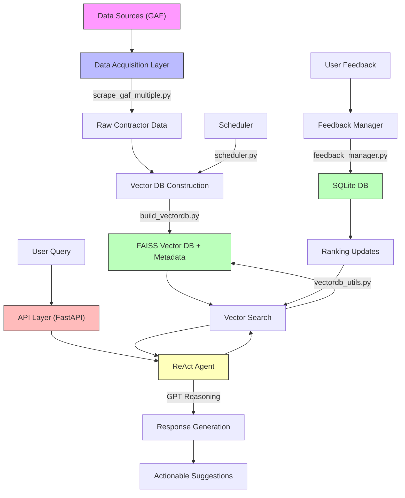

# GFA AI Sales Intelligence Platform

An AI-powered B2B sales intelligence platform for roofing distributors, leveraging GAF contractor data to generate actionable sales insights and recommendations.

## Overview

This platform helps sales teams identify, understand, and effectively engage with decision-makers by:

- Scraping and processing contractor data from GAF
- Providing semantic search capabilities
- Generating actionable sales recommendations
- Learning from user feedback to improve results
- Automating data updates and maintenance

## System Architecture



## Key Components

### 1. Data Acquisition & Preprocessing
- **Script:** `scrape_gaf_multiple.py`
- Extracts structured contractor information from GAF web pages
- Captures name, about, ratings, address, phone, certifications, etc.

### 2. Vector Database Construction
- **Script:** `build_vectordb.py`
- Uses FAISS and sentence-transformers
- Converts contractor profiles into vector embeddings
- Enables efficient semantic search

### 3. Automated Updates
- **Script:** `scheduler.py`
- Runs weekly updates (every Monday at 2:00 AM)
- Ensures data freshness

### 4. Semantic Search & ReAct Agent
- **Core Files:** `vectordb_utils.py`, `react_agent.py`
- Implements dynamic business metrics simulation
- Generates future-oriented recommendations
- Uses GPT for reasoning and response generation

### 5. Feedback System
- **Core File:** `feedback_manager.py`
- Collects and processes user feedback
- Implements Wilson score interval for robust ranking
- Continuously improves search results

### 6. API Layer
- **Core File:** `app.py`
- Built with FastAPI
- Handles queries and feedback submission
- Manages CORS and error handling

## Installation

1. Clone the repository:
```bash
git clone [repository-url]
cd GFA_AI
```

2. Create and activate a virtual environment:
```bash
python -m venv venv
source venv/bin/activate  # On Windows: venv\Scripts\activate
```

3. Install dependencies:
```bash
pip install -r requirements.txt
```

4. Set up environment variables:
```bash
cp .env.example .env
# Edit .env with your OpenAI API key and other settings
```

## Usage

1. Start the API server:
```bash
uvicorn app:app --reload
```

2. Access the API at `http://localhost:8000`

### API Endpoints

- `POST /chat`: Submit queries and get recommendations
- `POST /feedback`: Submit feedback on results
- `GET /feedback/stats`: View feedback statistics

### Example Queries

1. General Search:
```json
{
    "query": "Find top roofing contractors in New Jersey with high customer ratings"
}
```

2. Business Need:
```json
{
    "query": "Which contractors have not been contacted in the last month?"
}
```

3. Experience-Based:
```json
{
    "query": "Show me contractors in New York who have years of experiences"
}
```

## Test Cases

1. General Contractor Search
2. Specific Business Need
3. Years-Based Query
4. Activity-Based Prioritization
5. Regular Follow-Up
6. Feedback Submission
7. Feedback Statistics

## Future Improvements

1. **Agentic RAG Implementation**
   - Iterative query processing
   - Multi-hop reasoning
   - Dynamic context adaptation

2. **Model Fine-Tuning**
   - Domain-specific training
   - Business terminology optimization
   - Workflow alignment

3. **Business Metric Integration**
   - Apache Hive integration
   - Real-time business insights
   - Advanced analytics support

